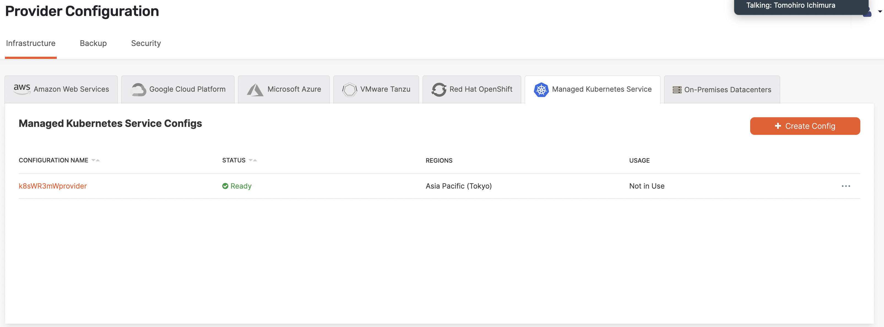
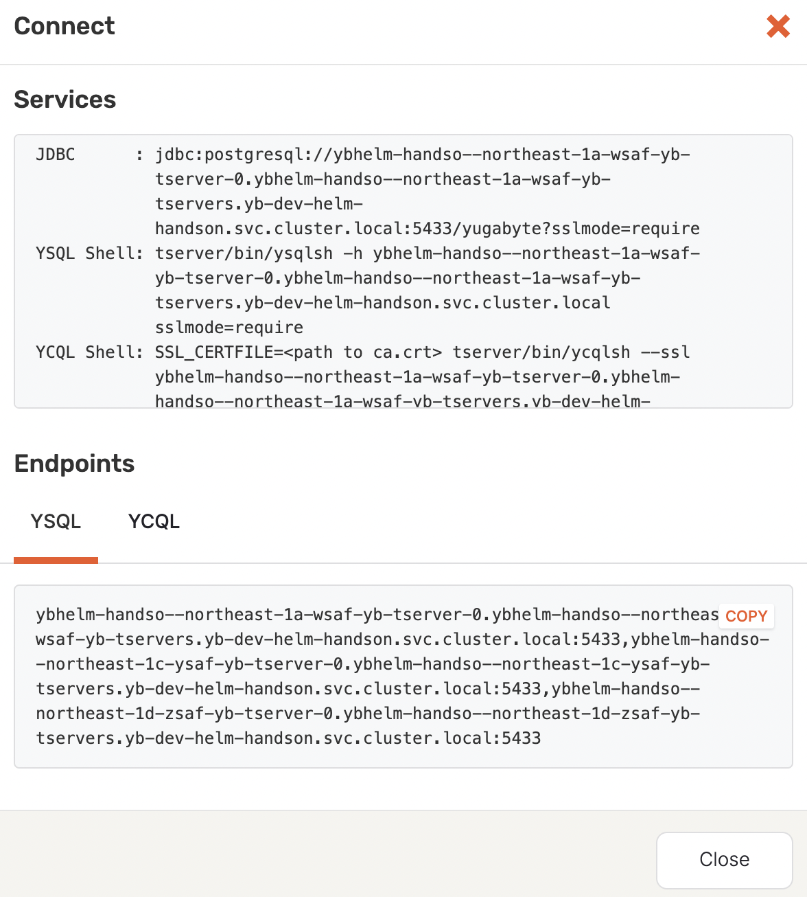

## はじめに
Duration: 01:00

### **YugabyteDBとは**

YugabyteDBは、PostgreSQLの全機能をサポートすることを目的とした、高性能でクラウドネイティブな分散型SQLデータベースです。

### **YugabyteDB Anywhereとは**

YugabyteDB Anywhere (YBA)は、YugabyteDBが提供するセルフマネージドDatabase-as-a-Serviceであり、YugabyteDBユニバースをスケーラブルにデプロイおよび運用することができます。

このハンズオンでは、Helmを使用して、YugabyteDB AnywhereとYugabyteDBのデプロイと簡単な運用、調査方法を実施します。

### **ハンズオンで実施すること**

このハンズオンでは、Helmを使用してYugabyteDB AnywhereとYugabyteDB Clusterを作成します。以下の内容を実施します:

* YugabyteDB Anywhereの作成
* YugabyteDB Cloud Providerの設置
* YugabyteDB Clusterの作成
* 簡単な運用と調査の実施

### **ハンズオン実施に必要なもの**

* インターネット接続可能な端末
* 既存のK8S Cluster（Nodeリソースは最低8 Core, 16 GB RAM, 250GB Storage）
* Helmインストール済み

## Pre-Flight Check
Duration: 03:00

* まずは、今回利用とするK8s Clusterにて、必要分のリソースがあるかどうかを確認します。

* `kubectl get nodes`と`kubectl describe nodes`でNode数と合計リソースを確認します。

* 下記はその一例です。
  
```
kubectl get nodes

NAME                                                STATUS   ROLES    AGE     VERSION
ip-192-168-12-2.ap-northeast-1.compute.internal     Ready    <none>   4d12h   v1.28.3-eks-e71965b
ip-192-168-40-255.ap-northeast-1.compute.internal   Ready    <none>   4d12h   v1.28.3-eks-e71965b
ip-192-168-8-77.ap-northeast-1.compute.internal     Ready    <none>   4d12h   v1.28.3-eks-e71965b
ip-192-168-80-223.ap-northeast-1.compute.internal   Ready    <none>   4d12h   v1.28.3-eks-e71965b
```

* `kubectl describe nodes`の場合、`capacity`の部分を注意してください。

```
Capacity:
  cpu:                8
  ephemeral-storage:  262131692Ki
  hugepages-1Gi:      0
  hugepages-2Mi:      0
  memory:             32042484Ki
  pods:               58
```

* 上記の例にて、Nodes数は4つ、1 Nodeあたりのリソースは8 Cores、32GB Memoryと250 GB Storageですので、合計は32 Cores、128 GB Memoryと1000 GB Storage、最低要求を満たしています。

* 次に、K8S ClusterとHelmのバージョンを確認します。最低要求はk8s > 1.22、Helm > 3.11.3以上であることです。

```
kubectl version

Client Version: v1.28.4
Kustomize Version: v5.0.4-0.20230601165947-6ce0bf390ce3
Server Version: v1.28.3-eks-4f4795d

helm version

version.BuildInfo{Version:"v3.13.2", GitCommit:"2a2fb3b98829f1e0be6fb18af2f6599e0f4e8243", GitTreeState:"clean", GoVersion:"go1.21.4"}
```

* AWS EKSを利用する場合、こちらの[リンク](https://docs.aws.amazon.com/eks/latest/userguide/csi-iam-role.html)を参照し、Amazon EBS CSI pluginが正確にインストールしているかどうかを確認してください。

* 上記のPre-Flight Checkが問題なければ、Helmを利用してYB Anywhereのインストールに進みます。

## Helm Based Yugbayte Anywhere Installation
Duration: 15:00

* 以下の kubectl create namespace コマンドを実行してネームスペースを作成します（Yugabye EKSを利用する場合、tagは自社名に設定してください）：

```
kubectl create namespace yb-platform-<tag>
```

* 以下の kubectl create コマンドを実行して、Yugabyte から取得した YugabyteDB Anywhere のシークレットを適用します：

```
kubectl create -f yugabyte-k8s-secret.yml -n yb-platform

secret/yugabyte-k8s-pull-secret created
```

* 以下のhelm repo addコマンドを実行して、[YugabyteDB chartsリポジトリ](https://charts.yugabyte.com)をクローンします：

```
helm repo add yugabytedb https://charts.yugabyte.com
```

* クローンが問題なく完了した場合、以下のようなメッセージが表示されます：

```
"yugabytedb" has been added to your repositories
```

* 既にChartsリポジトリを追加した場合、下記のようなメッセージが表示されます：

```
"yugabytedb" already exists with the same configuration, skipping
```

* 利用可能なチャート・バージョンを検索するには、次のコマンドを実行します：

```
helm search repo yugabytedb/yugaware

NAME                         	CHART VERSION	APP VERSION  	DESCRIPTION
yugabytedb/yugaware          	2.19.3       	2.19.3.0-b140	YugabyteDB Anywhere provides deployment, orches...
yugabytedb/yugaware-openshift	2.18.3       	2.18.3.0-b75 	YugabyteDB Anywhere provides deployment, orches...
```
* 今回はデフォルトのリソース要求でインストールではなく、最低限のリソースを利用したいので、下記のようにvaluesファイルを作成します：

```
touch yba-values.yaml
```

* その中身は下記となります（実際の環境に応じて編集することも可能）：

```
# yba-values.yaml
yugaware:
  # other values…
  resources:
    requests:
      cpu: "2"
      memory: "4Gi"

prometheus:
  # other values…
  resources:
    requests:
      cpu: "2"
      memory: "4Gi"

postgres:
  # other values…
  resources:
    requests:
      cpu: "1"
      memory: "2Gi"
```

* 注意：上記の`values`で、YBAで5 vCPUを消費しますが、後程で作成するYugabyteDBは1 Nodeで4 vCPU（tserver + master）を消費しますので、合計で9 vCPUとなります。YBAとYugabyteDB clusterを同一Zoneにデプロイする場合、そのZoneのCPUリソースを十分に用意してください（m5.2xlargeの場合は最低そのZoneに2インスタンスが必要）。

* 以下のhelm installコマンドを実行して、YugabyteDB Anywhere (yugaware) Helmチャートをインストールします：

```
helm install yw-test yugabytedb/yugaware --version 2.19.3 -n yb-platform --values yba-values.yaml
```

* 以下のコマンドを使用し、サービスをチェックします：

```
kubectl get svc -n yb-platform
NAME                  TYPE           CLUSTER-IP      EXTERNAL-IP                                                                   PORT(S)                       AGE
yw-test-yugaware-ui   LoadBalancer   10.100.101.51   a80a9f55142944db79bf427a3150758b-310831758.ap-northeast-1.elb.amazonaws.com   80:30754/TCP,9090:31061/TCP   2m26s
```

* Podも同様にチェックします：

```
kubectl get pods -n yb-platform
NAME                 READY   STATUS    RESTARTS   AGE
yw-test-yugaware-0   3/3     Running   0          2m32s
```

* 最後は下記のコマンドでYugawareが正確に初期化したことを確認します：

```
kubectl logs --follow -n yb-platform yw-test-yugaware-0 yugaware
```

* 出力にて、下記のログメッセージがあるかどうかを確認します：

```
[info]  AkkaHttpServer.scala:453 [main] play.core.server.AkkaHttpServer Listening for HTTP on /[0:0:0:0:0:0:0:0]:9000
```

* サービスのEndpointをアクセスし、下記のようなSetup画面が表示されます：
  


* 以上でYugabyteDB Anywhereのインストールは完了しました。


# Cloud Configurationの作成
Duration: 10:00

* まずはAdmin Accountを作成します：


* 上記のページにて、下記の内容を入力します：
    * 環境を選択する.
    * User credentialsを入力する.
    * EULAをチェックする.
    * Registerボタンをクッリクする.

### Cloud Providerを作成する

* YugabyteDB Anywhereを使用してユニバースをデプロイする前に、プロバイダ構成を作成する必要があります。

* プロバイダ構成はKubernetes環境を記述します。プロバイダ構成はユニバースをデプロイする際の入力として使用され、多くのユニバースに再利用できます。

* Kubernetesプロバイダを作成する前に、以下のコマンドを実行してください：
    - `yugabyte-platform-universe-management`の service accountを作成する。
    - 作成されたService accountを利用し、`kubeconfig` を生成する。

* Service Accountを作成するには、下記のコマンドを実行してください：
```
export YBA_NAMESPACE="yb-platform"

kubectl apply -f https://raw.githubusercontent.com/yugabyte/charts/master/rbac/yugabyte-platform-universe-management-sa.yaml -n ${YBA_NAMESPACE}
```

* 成功した場合、下記のメッセージが出力されます：
```
serviceaccount/yugabyte-platform-universe-management created
```

* 次のステップでは、ClusterRolesとRoles、ClusterRoleBindingsとRoleBindingsを使用してこのサービスアカウントにアクセス権を付与し、YugabyteDBユニバースのリソースを管理できるようにします。

* 必要に応じて`Global Restricted`や`Namespace Admin`などのRoleを利用することも可能ですが、今回は`Global Admin`で作ります：

```
export YBA_NAMESPACE="yb-platform"

curl -s https://raw.githubusercontent.com/yugabyte/charts/master/rbac/platform-global.yaml \
  | sed "s/namespace: <SA_NAMESPACE>/namespace: ${YBA_NAMESPACE}"/g \
  | kubectl apply -n ${YBA_NAMESPACE} -f -
```

* `kubeconfig`を作成するには、まず`kubeconfig`を作成するPython Scriptをダウンロードしてください：

```
wget https://raw.githubusercontent.com/YugaByte/charts/master/stable/yugabyte/generate_kubeconfig.py
```

* 次に、下記のコマンドを実行してください：

```
export YBA_NAMESPACE="yb-platform"

python generate_kubeconfig.py -s yugabyte-platform-universe-management -n ${YBA_NAMESPACE}
```

* 成功した場合は、下記のメッセージが出力されます：

```
Generated the kubeconfig file: /tmp/yugabyte-platform-universe-management.conf
```

* 作成した`kubeconfig`は`K8S Provider`を作成する際に必要ですので、安全に保存してください。


* K8S Providerを作成するには：
    
    1. `Configs > Managed Kubernetes Service > Create Kubernetes Config`をクリックし、`Create Kubernetes Provider Configuration`ページをOpenする。
    
    2. `Autofill local cluster config`をクリックし、必要なK8S config情報を自動入力する。
    3. `Upload Kube Config File`をクリックし、先程作成された`kubeconfig`ファイルを選択する。
    
    4. たまに`StorageClass`情報が正確にロードしない場合もありますので、`Regions > View`をクリックし、`StorageClass`の情報を確認する。何もロードしていない場合は、手動で入力し（全てのRegionに入力する必要があり）、設定情報をアップデートする。 
    
    5. `Create Provider Configuration`をクリックし、`K8S provider`を作成する。
    

* K8S Providerの作成が完了しました。


## Create a new Universe
Duration: 20:00

* YugabyteDB AnywhereはMulti-Zone、Multi-Region、Multi-Cloud、Read Replica、xClusterなど、多様な構成をサポートしていますが、今回は時間が限られているため、`Multi-Zone Universe`を作成します。

* Universeを作成するには：
  
    1. `Universes > Create Universe`をクリックする。
    
    2. `Name`を入力し、`Provider`、`Regions`、`Total Pods`、`Replication Factors`は全部デフォルトの値に設定する。
    
    3. `Instance Type`は`xsmall`、`Volume Info`は`50GB`に設定する。
    
    4. `YSQL Auth Password`を入力し、`Enable YCQL`のチェックを外します。
    
    5. 設定情報を確認する上、`Create Universe`をクリックする。
    
    6. 約10分で、Universeが作成される。

## Troubleshooting Tips
Duration: 10:00

* Universeが作成された後、そのUniverseのStatus確認方法や問題が発生した時の調査方法を紹介します。

* まずは`YBA UI > Universes > <Universe Name>`をクリックし、作成されたUniverseのOverviewページを確認します。


* このページで、最新のHealth Check Statusや現在のClusterリソース使用率情報などが確認できます。

* Overviewの右に、`Tables`、`Pods`など、Clusterの運営情報が確認できるページは複数あります。

* 右上の`Connect`をクリックすると、YSQLとYCQLへの`JDBC Connection String`やShellコマンドなどが出力されます。



* さらに右側に、`Actions`というDrop Menuがありますが、そこでUniverseの編集操作ができる以外に、`Support Bundle`が取集できます。


* `Create Support Bundle`をクリックすると、`Support Bundle`に含まれるログの種類や時間帯を選択できます。


* 一般的に、問題が発生した際は`Support Bundle`を取集してから調査しますが、問題の種類によって、`Support Bundle`を収集できない場合もあります。その際はPodへ直接ログインし、ログやエラメッセージなどを確認することも可能です。

* Podsページにて、全てのMasterとTserverがリストアップされていますが、一番右の`Actions`をクリックし、Drop Menuから`Connect`を選択するところで、Pod Shellに入るコマンドが出力されます。


* TserverとMaster LogのLocationはそれぞれ`/home/yugabyte/tserver/logs`と`/home/yugabyte/master/logs`になります。

* Pod自体が接続できない場合は、`kubectl describe`や`kubectl events`などのコマンドで、最近発生した変動やエラーなどを確認することを推奨します。

* まだ、Anywhere自体が問題発生した場合、下記コマンドでAnywhere Podへ接続し、ログファイルを確認することも可能です。

```
kubectl exec -it -n yb-platform yw-test-yugaware-0 -c yugaware -- sh

sh-4.4$ ls -ltr /opt/yugabyte/yugaware/data/logs
total 3776
-rw-r--r-- 1 yugabyte 10001  114077 Dec  4 00:01 application-log-2023-12-03.gz
-rw-r--r-- 1 yugabyte 10001  546266 Dec  4 05:00 audit.log
-rw-r--r-- 1 yugabyte 10001 3196667 Dec  4 06:23 application.log
```
